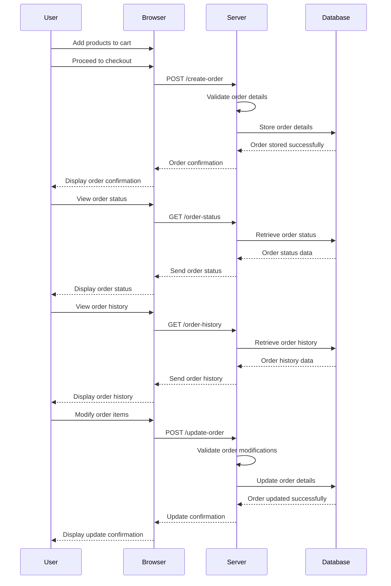

# Acceptance Criteria / Definition of Done (DoD) for Order Epic

## 1. Create and Manage Orders
- **User Story Description:** As a buyer, I want to place an order for selected products so that I can purchase them.
  - **Acceptance Criteria:**
    - Buyer can add products to their cart and proceed to order creation.
    - Order details (e.g., products, quantities, total amount) are correctly captured and stored in the system.
    - Buyer receives a confirmation that the order was successfully placed.
    - System generates a unique order ID for each order.

## 2. Order Status Tracking
- **User Story Description:** As a user, I want to track the status of my order (e.g., pending, shipped) so that I know when to expect delivery.
  - **Acceptance Criteria:**
    - Users can view the current status of their order.
    - Order status is updated in real-time and accurately reflected in the system.
    - Users receive notifications when their order status changes (e.g., order shipped).
    - Status updates include details such as estimated delivery date and shipping method.

## 3. Order History
- **User Story Description:** As a user, I want to view my order history so that I can see what I have purchased in the past.
  - **Acceptance Criteria:**
    - Users can access a history of their completed orders.
    - Order history includes details such as products ordered, dates, and status.
    - Users can filter and search their order history based on criteria such as date range and order status.
    - Users can export or print their order history if required.

## 4. Order Item Management
- **User Story Description:** As a user, I want to view and manage the items in my order so that I can make changes before finalizing my purchase.
  - **Acceptance Criteria:**
    - Users can add, remove, or modify items in their order before checkout.
    - The system updates the order summary to reflect changes in real-time.
    - Users receive confirmation of any changes made to the order items.
    - System ensures that all modifications are correctly reflected in the final order total and summary.

