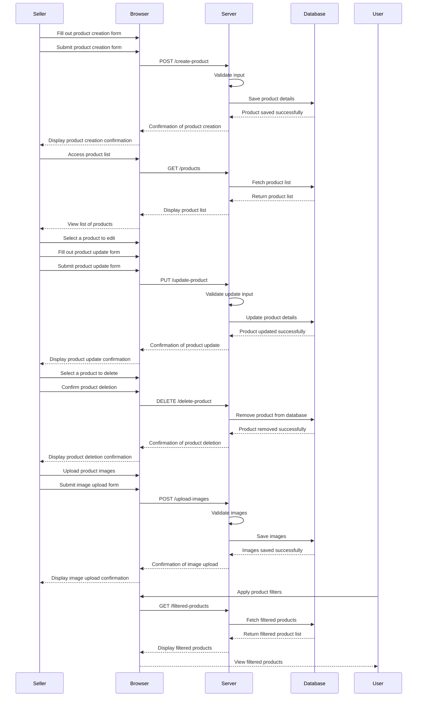

# EPIC Product

## Description:
This Epic covers the creation, management, and display of products on the platform. It includes functionalities for product details, filtering, gallery management, and categorization (e.g., Best Seller, Trending, Best Deals).

## User Stories:

### 1. **Create and Manage Products**
- **As a seller, I want to create and manage my products so that I can sell them on the platform.**

### 2. **Product Details Management**
- **As a seller, I want to add and update detailed information about my products (tags, release date, company name, language, etc.) so that buyers have all the necessary information.**

### 3. **Manage Product Gallery**
- **As a seller, I want to upload and manage product images so that my products are visually appealing to buyers.**

### 4. **Apply Filters to Products**
- **As a user, I want to filter products by criteria like Best Seller, Trending, and Best Deals so that I can find products that interest me.**

## Acceptance Criteria / Definition of Done (DoD):

### 1. **Create and Manage Products**
- **Product Creation:**
  - Seller can access a form to create a new product.
  - The form includes fields for product name, description, price, and other required details.
  - Seller can submit the form to create a product.
  - Product is saved in the database and visible in the seller’s product list.

- **Product Management:**
  - Seller can view a list of their products with options to edit or delete each product.
  - Seller can edit product details and save changes.
  - Seller can delete a product, and it is removed from the database and the product list.

### 2. **Product Details Management**
- **Detail Addition:**
  - Seller can add tags, release date, company name, and language to the product details.
  - Seller can update these details through a form or interface.

- **Detail Display:**
  - Product detail page displays all added information accurately.
  - Updated details are reflected immediately on the product page.

### 3. **Manage Product Gallery**
- **Image Upload:**
  - Seller can upload multiple images for each product.
  - Seller can drag-and-drop or select images from the file system.
  - Uploads are processed and saved without errors.

- **Image Management:**
  - Seller can view, update, or delete existing product images.
  - Images are displayed correctly on the product detail page, with appropriate loading and display performance.

### 4. **Apply Filters to Products**
- **Filter Functionality:**
  - Products can be tagged with filters like Best Seller, Trending, and Best Deals.
  - Users can select and apply filters to view products that match the chosen criteria.

- **Filter Display:**
  - Filtered product listings accurately reflect the selected filters.
  - Filtered results are displayed correctly and performance is optimized.

# Mermaid Diagram

