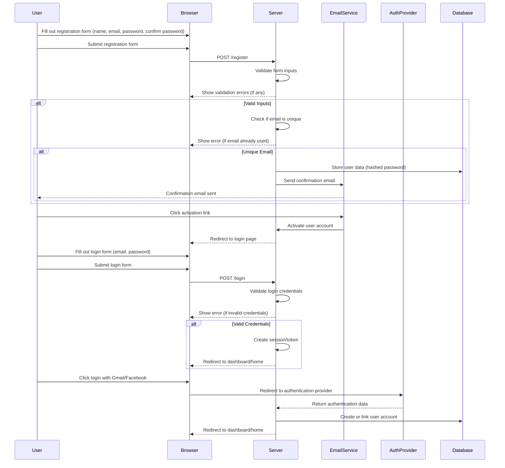

# Acceptance Criteria / Definition of Done (DoD)

## User Registration and Login

### 1. User Registration

- **User Registration Form**
  - [ ] The registration form must include fields for name, email, password, and confirm password.
  - [ ] The form must validate that the email is unique and not already in use.
  - [ ] The password field must have a minimum length requirement (e.g., 8 characters).
  - [ ] The password and confirm password fields must match.
  - [ ] The form must handle errors gracefully, showing appropriate error messages for invalid input.

- **Registration Process**
  - [ ] Upon successful registration, the user should receive a confirmation email with an activation link.
  - [ ] The user account must be created and stored in the database.
  - [ ] The system must handle duplicate email addresses and show an appropriate error message.

- **Account Activation**
  - [ ] The activation link in the confirmation email should direct the user to a page that activates their account.
  - [ ] The user should be redirected to the login page after successful account activation.
  - [ ] The account should be marked as active in the database once the activation link is used.

### 2. User Login

- **Login Form**
  - [ ] The login form must include fields for email and password.
  - [ ] The form must validate the email and password combination against the database.
  - [ ] The form must handle errors gracefully, showing appropriate error messages for invalid login attempts.

- **Login Process**
  - [ ] Upon successful login, the user should be redirected to their dashboard or home page.
  - [ ] The system must create a session or token to maintain the user’s logged-in state.
  - [ ] The user should have the option to stay logged in (e.g., remember me checkbox).

- **Login Using Gmail and Facebook**
  - [ ] The login process must support authentication via Gmail and Facebook.
  - [ ] Users must be redirected to the respective authentication provider for login.
  - [ ] Upon successful authentication, users should be redirected to their dashboard or home page.
  - [ ] The system must handle the creation of a new account or linking an existing account based on the authentication provider's response.

### 3. Security and Validation

- **Password Security**
  - [ ] Passwords must be stored securely using hashing algorithms.
  - [ ] Passwords must not be exposed or stored in plain text.

- **Session Management**
  - [ ] Sessions or tokens must be securely managed and invalidated upon logout.
  - [ ] Users must be able to log out successfully, and their session should be terminated.

- **Error Handling**
  - [ ] The system must provide clear and actionable error messages for failed registration or login attempts.
  - [ ] The system must handle edge cases, such as expired or invalid activation links.

### 4. Testing and Documentation

- **Testing**
  - [ ] The registration and login functionalities must be tested for various scenarios, including valid and invalid inputs.
  - [ ] Automated tests must be created to validate registration and login processes.

- **Documentation**
  - [ ] The registration and login processes must be documented in the system's user guide.
  - [ ] The API endpoints for registration and login must be documented with their request and response formats.

# Mermaid Diagram

