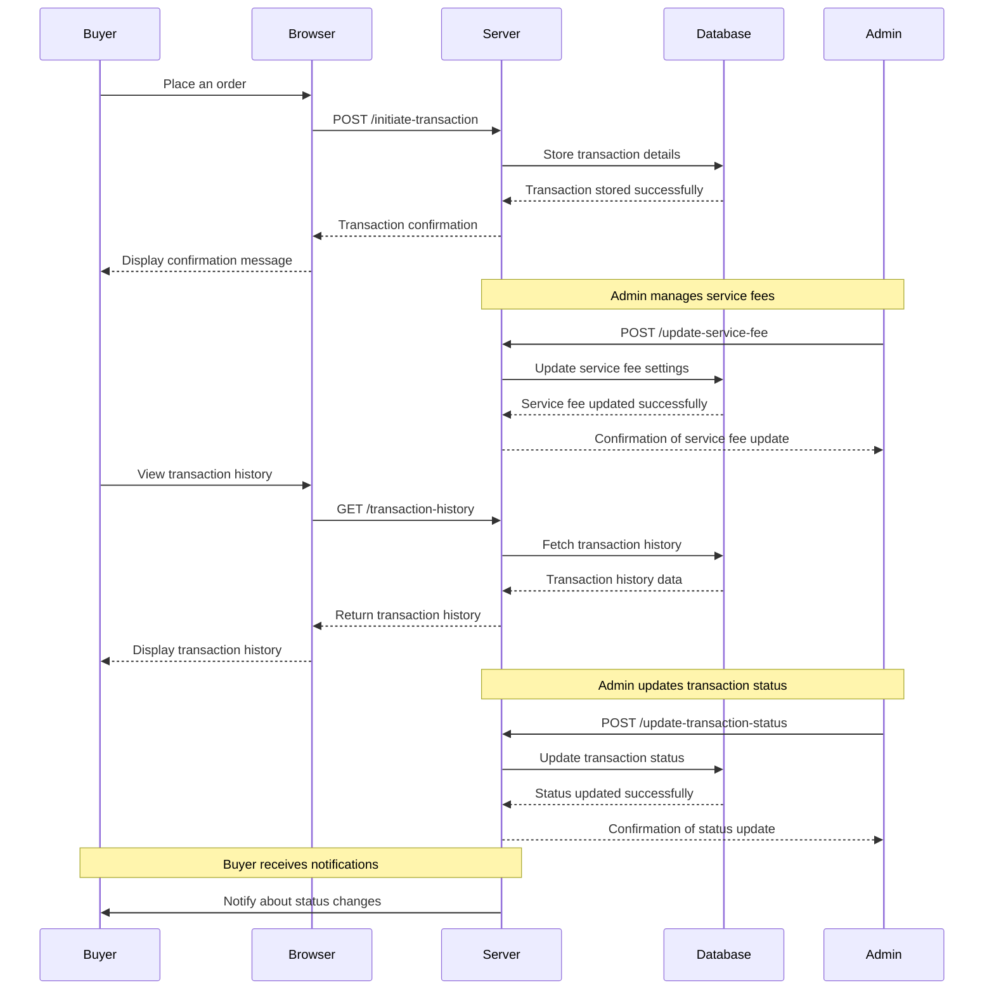

# Acceptance Criteria / Definition of Done (DoD) for Epic Transaction

## 1. Initiate and Manage Transactions
   - **AC1.1**: The system allows a buyer to initiate a transaction upon placing an order.
   - **AC1.2**: All transaction details, including order ID, payment method, and transaction amount, are captured and stored correctly.
   - **AC1.3**: The buyer receives a confirmation notification (email or in-app) indicating that the transaction was successful.
   - **AC1.4**: The transaction status is updated in the system and is accessible to both the buyer and admin.
   - **AC1.5**: Any errors or issues during the transaction initiation are logged and reported for troubleshooting.

## 2. Service Fee Management
   - **AC2.1**: Admins can set and update service fees for transactions through the platform's admin interface.
   - **AC2.2**: The system applies the configured service fees accurately during the transaction process.
   - **AC2.3**: Admins can view and manage the current service fee settings, including historical changes if needed.
   - **AC2.4**: Changes to service fee settings are reflected immediately and correctly in ongoing and future transactions.
   - **AC2.5**: Service fee management functionalities are protected by appropriate access controls.

## 3. Transaction History
   - **AC3.1**: Users can access and view a detailed history of their completed transactions.
   - **AC3.2**: Transaction history includes essential details such as transaction date, amount, status, and payment method.
   - **AC3.3**: Users can filter or search their transaction history based on criteria such as date range, amount, and status.
   - **AC3.4**: Users can export or print their transaction history if required.
   - **AC3.5**: Admins can access a comprehensive transaction history report, including aggregated data and trends.

## 4. Transaction Status Updates
   - **AC4.1**: Admins can view and update the status of ongoing transactions (e.g., pending, completed, refunded).
   - **AC4.2**: Transaction status updates are reflected in real-time for both the user and admin interfaces.
   - **AC4.3**: Admins receive notifications or alerts for transactions requiring attention or intervention.
   - **AC4.4**: The system logs all status changes and provides an audit trail for transaction management.
   - **AC4.5**: Users receive notifications about significant status updates (e.g., completed, refunded) related to their transactions.

# Mermaid Diagram

