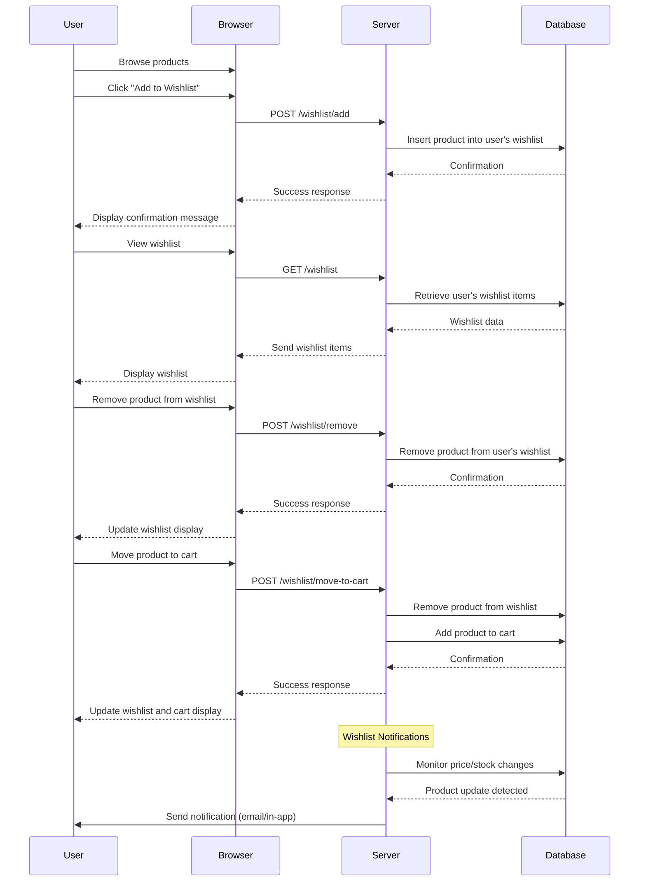

### Acceptance Criteria / Definition of Done (DoD):

1. **Add Products to Wishlist**
   - Users can add products to their wishlist from product detail pages.
   - The wishlist is associated with the user's account.
   - The system provides feedback confirming the addition.
   - The action is performed instantly without significant delay.

2. **View Wishlist**
   - Users can access their wishlist from the main navigation or user profile.
   - The wishlist displays all added products with relevant details (product name, image, price, availability).
   - The page loads within acceptable time (e.g., under 2 seconds).

3. **Remove Products from Wishlist**
   - Users can remove items from their wishlist individually.
   - The system provides feedback confirming the removal.
   - The wishlist updates immediately to reflect the change.

4. **Move Products from Wishlist to Cart**
   - Users can select products to add to their cart directly from the wishlist.
   - Products moved to the cart are removed from the wishlist (if applicable).
   - The system confirms the successful addition to the cart.
   - Cart totals and counts are updated accordingly.

5. **Wishlist Notifications**
   - Users receive notifications when products in their wishlist have price drops or come back in stock.
   - Users can opt-in or opt-out of wishlist notifications.
   - Notifications are sent promptly when triggering events occur.
   - The system ensures that notifications are only sent for opted-in products and users.

---

### Sequence Diagram

