# Struktur Database

## Database Game E-Commerce

Database ini dirancang untuk mendukung platform e-commerce game dengan tujuan mengelola data pengguna, produk, transaksi, dan interaksi. Struktur tabel yang digunakan adalah:

- **users**: Menyimpan data pengguna untuk mengelola buyer dan seller.
- **products**: Menyimpan informasi game yang dijual di platform.
- **orders**: Mengelola pesanan yang dibuat oleh buyer.
- **order_items**: Mencatat detail setiap item dalam pesanan.
- **transactions**: Menyimpan data transaksi pembayaran.
- **checkouts**: Mengelola data proses checkout pembelian.
- **discounts, order_discounts, product_discounts**: Mengelola diskon untuk pesanan atau produk.
- **wishlists**: Menyimpan daftar game yang diinginkan oleh buyer.
- **product_details**: Menyediakan informasi detail tambahan tentang produk.
- **gallery**: Menyimpan gambar dan media terkait game.
- **master_system_requirements, detail_requirements**: Menyimpan persyaratan sistem untuk menjalankan game.
- **product_filters, filters**: Mengelola kriteria pencarian game.

**Tujuan**: Memastikan pengelolaan data yang efisien, mendukung penjualan game digital, manajemen produk, dan memfasilitasi pengalaman pengguna di platform.

## Diagram ERD

```mermaid
erDiagram

    users {
        INT id PK
        VARCHAR name
        VARCHAR email
        VARCHAR password
        ENUM role
        TIMESTAMP created_at
        TIMESTAMP updated_at
    }

    profiles {
        INT id PK
        INT user_id FK
        TEXT address
        VARCHAR phone_number
        TIMESTAMP created_at
        TIMESTAMP updated_at
    }

    products {
        INT id PK
        VARCHAR name
        TEXT description
        DECIMAL price
        INT stock
        INT seller_id FK
        VARCHAR thumbnail
        TIMESTAMP created_at
        TIMESTAMP updated_at
    }

    product_details {
        INT id PK
        INT product_id FK
        VARCHAR tag
        VARCHAR workson
        DATE release_date
        VARCHAR company_name
        VARCHAR size
        VARCHAR language
        TIMESTAMP created_at
        TIMESTAMP updated_at
    }

    gallery {
        INT id PK
        INT product_id FK
        VARCHAR image_url
        TIMESTAMP created_at
        TIMESTAMP updated_at
    }

    orders {
        INT id PK
        VARCHAR order_number
        INT user_id FK
        DECIMAL total_price
        VARCHAR status
        TIMESTAMP created_at
        TIMESTAMP updated_at
    }

    order_items {
        INT id PK
        INT order_id FK
        INT product_id FK
        INT quantity
        DECIMAL price
        TIMESTAMP created_at
        TIMESTAMP updated_at
    }

    payments {
        INT id PK
        VARCHAR payment_method
        TIMESTAMP payment_date
        DECIMAL amount
        VARCHAR status
        TIMESTAMP created_at
        TIMESTAMP updated_at
    }

    transactions {
        INT id PK
        INT order_id FK
        INT payment_id FK
        TIMESTAMP transaction_date
        VARCHAR status
        DECIMAL service_fee
        TIMESTAMP created_at
        TIMESTAMP updated_at
    }

    checkouts {
        INT id PK
        INT order_id FK
        TIMESTAMP checkout_date
        TIMESTAMP created_at
        TIMESTAMP updated_at
    }

    discounts {
        INT id PK
        VARCHAR discount_code
        TEXT description
        DECIMAL discount_amount
        DECIMAL discount_percentage
        DATE start_date
        DATE end_date
        TIMESTAMP created_at
        TIMESTAMP updated_at
    }

    order_discounts {
        INT id PK
        INT order_id FK
        INT discount_id FK
        DECIMAL discount_amount
        TIMESTAMP created_at
        TIMESTAMP updated_at
    }

    product_discounts {
        INT id PK
        INT product_id FK
        INT discount_id FK
        DECIMAL discount_amount
        TIMESTAMP created_at
        TIMESTAMP updated_at
    }

    wishlists {
        INT id PK
        INT user_id FK
        INT product_id FK
        TIMESTAMP created_at
        TIMESTAMP updated_at
    }

    master_system_requirements {
        INT id PK
        INT product_id FK
        ENUM type
        TEXT requirement
        TIMESTAMP created_at
        TIMESTAMP updated_at
    }

    detail_requirements {
        INT id PK
        INT master_system_requirement_id FK
        VARCHAR system_operation
        VARCHAR processor
        VARCHAR memory
        VARCHAR graphics
        VARCHAR directx
        VARCHAR storage
        TIMESTAMP created_at
        TIMESTAMP updated_at
    }

    filters {
        INT id PK
        VARCHAR name
        TIMESTAMP created_at
        TIMESTAMP updated_at
    }

    product_filters {
        INT id PK
        INT product_id FK
        INT filter_id FK
        TIMESTAMP created_at
        TIMESTAMP updated_at
    }

    %% Relationships

    profiles ||--|| users : "user_id > id"
    products ||--|| users : "seller_id > id"
    orders ||--|| users : "user_id > id"
    order_items ||--|| orders : "order_id > id"
    order_items ||--|| products : "product_id > id"
    transactions ||--|| orders : "order_id > id"
    transactions ||--|| payments : "payment_id > id"
    checkouts ||--|| orders : "order_id > id"
    order_discounts ||--|| orders : "order_id > id"
    order_discounts ||--|| discounts : "discount_id > id"
    product_discounts ||--|| products : "product_id > id"
    product_discounts ||--|| discounts : "discount_id > id"
    wishlists ||--|| users : "user_id > id"
    wishlists ||--|| products : "product_id > id"
    product_details ||--|| products : "product_id > id"
    gallery ||--|| products : "product_id > id"
    master_system_requirements ||--|| products : "product_id > id"
    detail_requirements ||--|| master_system_requirements : "master_system_requirement_id > id"
    product_filters ||--|| products : "product_id > id"
    product_filters ||--|| filters : "filter_id > id"
```

